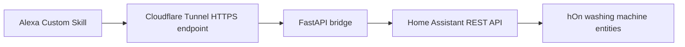

# Case Study - Alexa Custom Skill Laundry MVP

## Goal

Build a public HTTPS voice bridge that lets an Alexa Custom Skill query Home Assistant for washing machine status without exposing Home Assistant directly.

## Architecture



## Components

- Alexa Developer Console custom skill
- Cloudflare Tunnel HTTPS hostname
- FastAPI bridge running through Uvicorn
- systemd service for persistent bridge execution
- Home Assistant REST API
- hOn washing machine entities

## Implemented Routes

- `GET /`
- `GET /health`
- `GET /laundry/status`
- `POST /alexa`
- `POST /alexa/laundry`

## Validated Flow

```text
Alexa
→ Custom Skill
→ HTTPS endpoint
→ Cloudflare Tunnel
→ FastAPI bridge
→ Home Assistant
→ Alexa voice response
```

## MVP Outcome

The custom Alexa skill was successfully validated end-to-end.

Validated user flow:

```text
Alexa, ask Alfred The Butler how much time is left on the washing machine
```

Current result:

```text
The washing machine is currently not connected.
```

or, when available:

```text
Washing machine program: <program name>
Remaining time: <remaining time>
```

Additional work completed after the initial bridge validation:

- Assistant persona renamed from Albert to Alfred.
- Added custom launch response.
- Added Supported Features intent.
- Added LaundryStatusIntent.
- Refactored the FastAPI bridge into smaller modules:
  - configuration
  - Home Assistant client
  - Alexa response helpers
  - laundry service
  - Alfred response helper
- Added SSML-based Alfred responses.
- Validated custom intent routing through the Alexa Developer Console.
- Validated LaundryStatusIntent end-to-end.

## Issues Found

### Wrong endpoint path

Alexa must call the Alexa-compatible route:

```text
https://<public-alexa-bridge-host>/alexa
```

not the human/API status route.

### Wildcard certificate setting

When the public HTTPS hostname uses a wildcard certificate, the Alexa Developer Console endpoint SSL option must be set to the wildcard certificate option.

### Template intent interception

The starter template intent intercepted the laundry utterance before the intended laundry intent was fully configured.

Temporary workaround:

```text
HelloWorldIntent → laundry status handler
```

Final cleanup should move all utterances to `LaundryStatusIntent` and remove or empty the template intent.

## Security Notes

Do not commit:

- real public endpoint
- Home Assistant URL
- Home Assistant token
- Alexa debug payloads
- Alexa user IDs
- Alexa device IDs
- Alexa access tokens
- Cloudflare credentials
