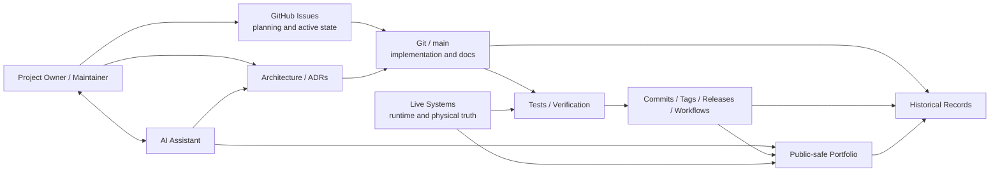

# AI-Assisted Development Flow

## Purpose

This diagram shows where AI assists the engineering process without becoming the source of truth for implementation, planning or runtime state.

## Responsibility Boundaries

- **GitHub Issues** own planning, priorities, dependencies and active task state.
- **Git / `main`** owns merged implementation and versioned documentation.
- **Commits, tags, releases and workflows** provide implementation/release evidence.
- **Live systems** provide deployed and physical-state evidence.
- **AI** assists research, troubleshooting, design review, drafting and knowledge organization.
- **The project maintainer** owns architecture decisions, implementation choices, safety decisions and production validation.
- **The portfolio** is derived public-safe documentation, not a development-state database.
- **Historical records** preserve prior decisions and intermediate designs without overriding current evidence.

AI output becomes project documentation or implementation only after human review and evidence-backed integration through the normal GitHub/Git workflow.
