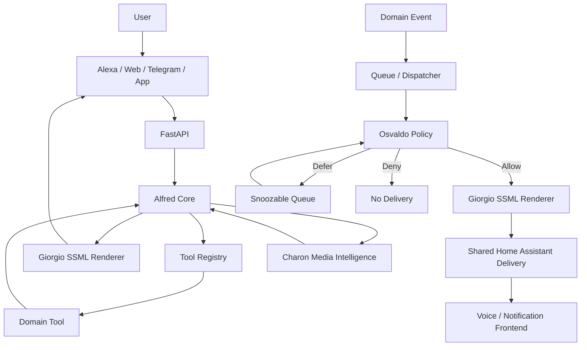

# Alfred Ecosystem Flow

## Interactive Flow

The interactive path starts with an explicit user request.

Alfred selects and executes a registered tool, then Giorgio renders the response for the active frontend.

Osvaldo does not decide whether an interactive response may be delivered.

## Proactive Flow

The proactive path starts with a domain event rather than an explicit user request.

Osvaldo evaluates whether the event should be delivered immediately, deferred to the snoozable queue or denied.

Allowed messages are rendered by Giorgio and sent through the shared Home Assistant delivery service.

## Boundaries

- Alfred owns request routing and tool execution.
- Giorgio owns speech rendering.
- Osvaldo owns proactive notification policy.
- Charon owns media-domain intelligence.
- Domain services emit events but do not own delivery policy.
- Shared delivery owns the physical Home Assistant notification call.
