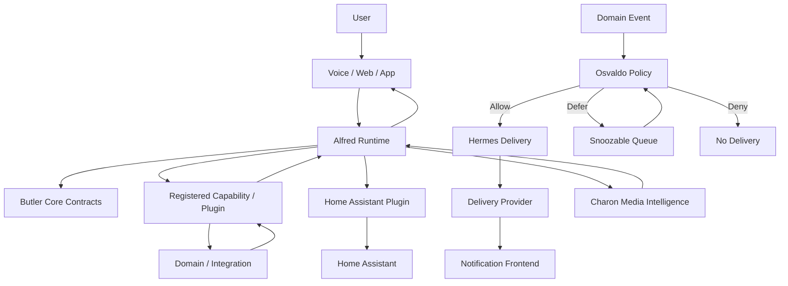

# Alfred Ecosystem Flow

```mermaid
flowchart TD
    User[User] --> Frontend[Voice / Web / App]
    Frontend --> Alfred[Alfred Runtime]

    Alfred --> Core[Butler Core Contracts]
    Alfred --> Capability[Registered Capability / Plugin]

    Capability --> Domain[Domain / Integration]
    Domain --> Capability
    Capability --> Alfred
    Alfred --> Frontend

    Alfred --> HAP[Home Assistant Plugin]
    HAP --> HA[Home Assistant]

    Event[Domain Event] --> Osvaldo[Osvaldo Policy]

    Osvaldo -->|Allow| Hermes[Hermes Delivery]
    Osvaldo -->|Defer| Snoozable[Snoozable Queue]
    Osvaldo -->|Deny| NoDelivery[No Delivery]

    Snoozable --> Osvaldo
    Hermes --> Provider[Delivery Provider]
    Provider --> NotificationFrontend[Notification Frontend]

    Alfred --> Charon[Charon Media Intelligence]
    Charon --> Alfred
```

## Interactive Flow

The interactive path starts with an explicit user request.

Alfred owns Keriol-specific context, routing and runtime composition while using Butler Core contracts and reusable plugins directly.

Known requests resolve deterministically before planner or AI fallback where possible.

Home Assistant access may flow through HAP without introducing a Wilfred runtime dependency.

The result returns through the active frontend. Provider-specific speech, SSML and presentation stay outside Butler Core.

## Proactive Flow

The proactive path starts with a domain event.

Osvaldo determines whether communication is allowed, deferred, aggregated or denied.

After an allow decision, Hermes routes the output to a delivery provider. The provider/frontend owns transport-specific rendering.

For current Alexa speech notifications, the configured voice selection is applied during frontend/provider rendering. Giorgio is therefore a voice parameter, not a policy, delivery or domain component.

## Public / Private Boundary

Butler Core, Wilfred and official public plugins are reusable public components.

Wilfred and Alfred are sibling Butler runtimes built on shared Core contracts. Alfred, Osvaldo, Charon and the current Hermes deployment belong to the private Keriol proving ground, although selected sanitized architecture and case studies may be documented publicly.

Private validation may support an **In testing** maturity label. The architecture may be **Designed to enable** later public extraction, but neither state is a release commitment.

See [ADR-012 - Sibling Butler Runtimes and Independent Platform Plugins](../adr/ADR-012-sibling-runtimes-and-independent-platform-plugins.md).
