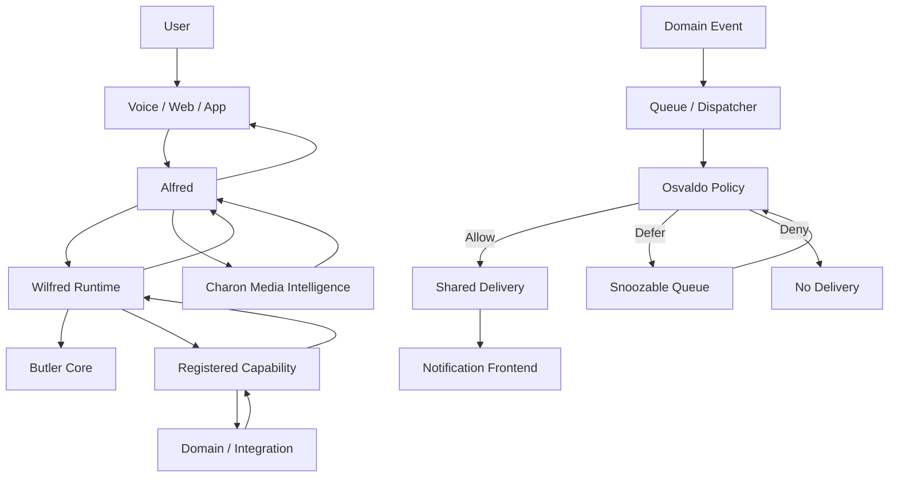

# Alfred Ecosystem Flow

```mermaid
flowchart TD
    User[User] --> Frontend[Voice / Web / App]
    Frontend --> Alfred[Alfred]

    Alfred --> Wilfred[Wilfred Runtime]
    Wilfred --> Core[Butler Core]
    Wilfred --> Capability[Registered Capability]

    Capability --> Domain[Domain / Integration]
    Domain --> Capability
    Capability --> Wilfred
    Wilfred --> Alfred
    Alfred --> Frontend

    Event[Domain Event] --> Queue[Queue / Dispatcher]
    Queue --> Osvaldo[Osvaldo Policy]

    Osvaldo -->|Allow| Delivery[Shared Delivery]
    Osvaldo -->|Defer| Snoozable[Snoozable Queue]
    Osvaldo -->|Deny| NoDelivery[No Delivery]

    Snoozable --> Osvaldo
    Delivery --> NotificationFrontend[Notification Frontend]

    Alfred --> Charon[Charon Media Intelligence]
    Charon --> Alfred
```

## Interactive Flow

The interactive path starts with an explicit user request.

Alfred supplies Keriol-specific interaction context while Wilfred provides the reusable execution runtime.

The result returns through the active frontend.

Frontend-specific presentation remains outside the Butler architecture.

## Proactive Flow

The proactive path starts with a domain event.

Osvaldo determines whether communication is allowed, deferred, aggregated or denied before shared delivery occurs.

## Public / Private Boundary

Wilfred and Butler Core are reusable public components.

Alfred, Osvaldo and Charon belong to the private Keriol deployment, although selected sanitized architecture and case studies may be documented publicly.

Private validated functionality may later become a candidate for extraction into the public runtime.
