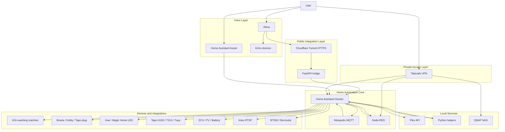

# Architecture

```mermaid
flowchart TD
    User[User]

    subgraph Voice["Voice Layer"]
        Alexa[Alexa]
        Assist[Home Assistant Assist]
        Echo[Echo devices]
    end

    subgraph Public["Public Integration Layer"]
        CF[Cloudflare Tunnel HTTPS]
        FastAPI[FastAPI bridge]
    end

    subgraph Private["Private Access Layer"]
        VPN[Tailscale VPN]
    end

    subgraph Core["Home Automation Core"]
        HA[Home Assistant Docker]
        MQTT[Mosquitto MQTT]
        NodeRED[Node-RED]
    end

    subgraph Services["Local Services"]
        Plex[Plex API]
        Python[Python helpers]
        QNAP[QNAP NAS]
    end

    subgraph Devices["Devices and Integrations"]
        Laundry[hOn washing machine]
        Theater[Bravia / Dolby / Tapo plug]
        Lights[Hue / Magic Home LED]
        Climate[Tapo H100 / T310 / Tuya]
        Energy[ZCS / PV / Battery]
        Cameras[Imou RTSP]
        Presence[BT500 / Bermuda]
    end

    User --> Alexa
    User --> Assist
    User --> VPN

    Alexa --> Echo
    Alexa --> CF
    CF --> FastAPI
    FastAPI --> HA

    Assist --> HA
    VPN --> HA
    VPN --> QNAP
    VPN --> NodeRED

    HA --> MQTT
    HA --> NodeRED
    HA --> Python
    HA --> Plex

    HA --> Laundry
    HA --> Theater
    HA --> Lights
    HA --> Climate
    HA --> Energy
    HA --> Cameras
    HA --> Presence

    MQTT --> HA
    NodeRED --> HA
    Python --> HA
```
