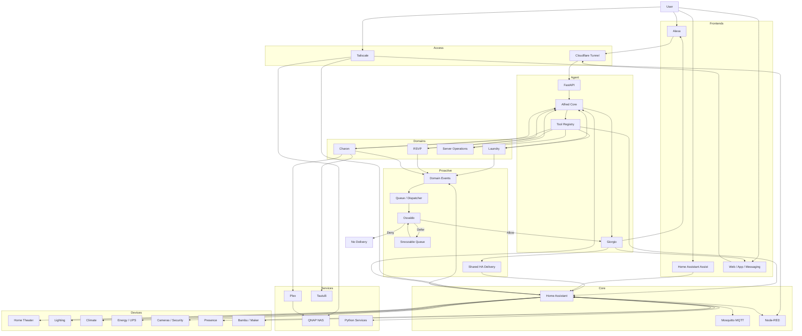

# Architecture

## Reading the Diagram

The interactive path starts from a frontend and reaches Alfred through FastAPI. Alfred selects a registered domain tool and Giorgio renders the response.

The proactive path starts from a domain event. Osvaldo decides whether the event may be delivered, deferred or denied before Giorgio and the shared Home Assistant delivery service are involved.

Home Assistant remains responsible for physical orchestration and device wrappers. Alfred coordinates capabilities but does not replace the home-automation core.
