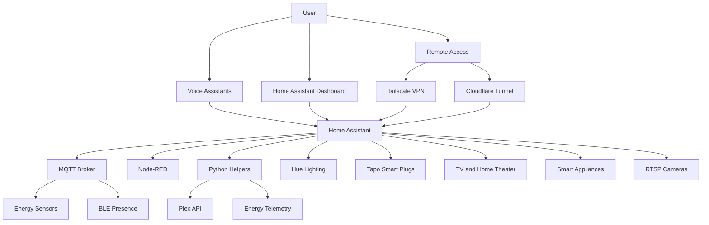

# Architecture Diagram

```mermaid
flowchart TD
    User[User]

    User --> Voice[Voice Assistants]
    User --> Dashboard[Home Assistant Dashboard]
    User --> Remote[Remote Access]

    Voice --> HA[Home Assistant]
    Dashboard --> HA

    HA --> MQTT[MQTT Broker]
    HA --> NR[Node-RED]
    HA --> PY[Python Helpers]

    MQTT --> Energy[Energy Sensors]
    MQTT --> Presence[BLE Presence]

    PY --> Plex[Plex API]
    PY --> ZCS[Energy Telemetry]

    HA --> Lights[Hue Lighting]
    HA --> Plugs[Tapo Smart Plugs]
    HA --> Media[TV and Home Theater]
    HA --> Appliances[Smart Appliances]
    HA --> Cameras[RTSP Cameras]

    Remote --> Tailscale[Tailscale VPN]
    Remote --> Cloudflare[Cloudflare Tunnel]

    Tailscale --> HA
    Cloudflare --> HA
```
