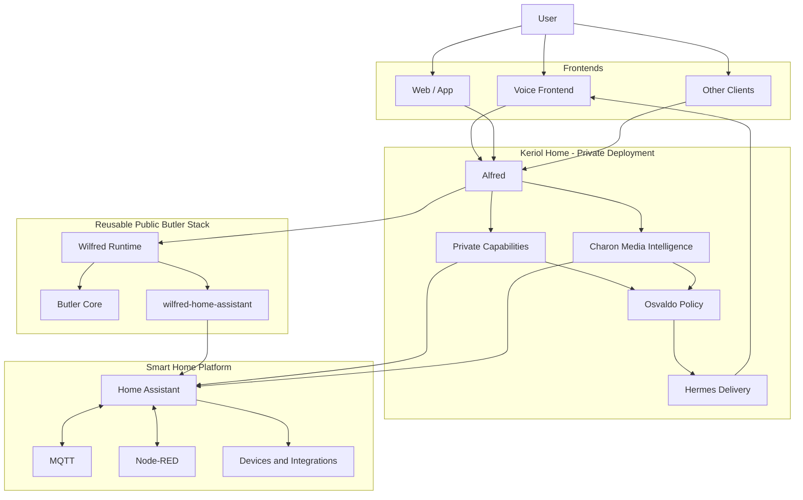

# Architecture

```mermaid
flowchart TD
    User[User]

    subgraph Frontends
        Voice[Voice Frontend]
        Web[Web / App]
        Other[Other Clients]
    end

    subgraph Private["Keriol Home - Private Deployment"]
        Alfred[Alfred]
        Osvaldo[Osvaldo Policy]
        Charon[Charon Media Intelligence]
        Hermes[Hermes Delivery]
        PrivateCaps[Private Capabilities]
    end

    subgraph Public["Reusable Public Butler Stack"]
        Wilfred[Wilfred Runtime]
        Core[Butler Core]
        HAPlugin[wilfred-home-assistant]
    end

    subgraph Home["Smart Home Platform"]
        HA[Home Assistant]
        MQTT[MQTT]
        NodeRED[Node-RED]
        Devices[Devices and Integrations]
    end

    User --> Voice
    User --> Web
    User --> Other

    Voice --> Alfred
    Web --> Alfred
    Other --> Alfred

    Alfred --> Wilfred
    Wilfred --> Core

    Wilfred --> HAPlugin
    HAPlugin --> HA

    Alfred --> PrivateCaps
    Alfred --> Charon

    PrivateCaps --> Osvaldo
    Charon --> Osvaldo
    Osvaldo --> Hermes
    Hermes --> Voice

    PrivateCaps --> HA
    Charon --> HA

    HA --> Devices
    HA <--> MQTT
    HA <--> NodeRED
```

## Reading the Diagram

The reusable public stack consists of Butler Core, Wilfred and public plugins.

Alfred is the private Keriol Home deployment built above that reusable runtime.

Private capabilities may use Wilfred execution facilities while remaining unavailable from the public distribution.

Osvaldo owns proactive communication policy. Hermes owns private delivery/provider responsibilities after policy approval. Frontend-specific rendering remains outside Butler Core.

The current Alexa voice used for Alfred speech notifications is a provider/frontend rendering parameter and is intentionally not shown as an architectural node.

Home Assistant remains the owner of physical device orchestration.

Capabilities validated privately may later be generalized into Wilfred, Butler Core or an official plugin, but extraction is neither automatic nor a release commitment.
