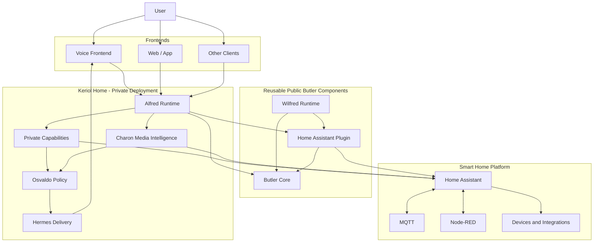

# Architecture

```mermaid
flowchart TD
    User[User]

    subgraph Frontends
        Voice[Voice Frontend]
        Web[Web / App]
        Other[Other Clients]
    end

    subgraph Private["Keriol Home - Private Deployment"]
        Alfred[Alfred Runtime]
        Osvaldo[Osvaldo Policy]
        Charon[Charon Media Intelligence]
        Hermes[Hermes Delivery]
        PrivateCaps[Private Capabilities]
    end

    subgraph Public["Reusable Public Butler Components"]
        Core[Butler Core]
        Wilfred[Wilfred Runtime]
        HAP[Home Assistant Plugin]
    end

    subgraph Home["Smart Home Platform"]
        HA[Home Assistant]
        MQTT[MQTT]
        NodeRED[Node-RED]
        Devices[Devices and Integrations]
    end

    User --> Voice
    User --> Web
    User --> Other

    Voice --> Alfred
    Web --> Alfred
    Other --> Alfred

    Wilfred --> Core
    Alfred --> Core
    HAP --> Core

    Wilfred --> HAP
    Alfred --> HAP
    HAP --> HA

    Alfred --> PrivateCaps
    Alfred --> Charon

    PrivateCaps --> Osvaldo
    Charon --> Osvaldo
    Osvaldo --> Hermes
    Hermes --> Voice

    PrivateCaps --> HA
    Charon --> HA

    HA --> Devices
    HA <--> MQTT
    HA <--> NodeRED
```

## Reading the Diagram

Butler Core provides the shared provider-neutral contract foundation.

Wilfred and Alfred are sibling Butler runtimes. Neither runtime is built on the other.

Home Assistant Plugin is reusable integration infrastructure built on Core-owned contracts and may be consumed independently by either runtime.

Alfred remains the private Keriol Home runtime and proving ground. Private capabilities can remain household-specific while reusable behavior graduates into Core, Wilfred or independent public plugins.

Osvaldo owns proactive communication policy. Hermes owns private delivery/provider responsibilities after policy approval. Frontend-specific rendering remains outside Butler Core.

Home Assistant remains the owner of physical device orchestration.

See [ADR-012 - Sibling Butler Runtimes and Independent Platform Plugins](../adr/ADR-012-sibling-runtimes-and-independent-platform-plugins.md).
