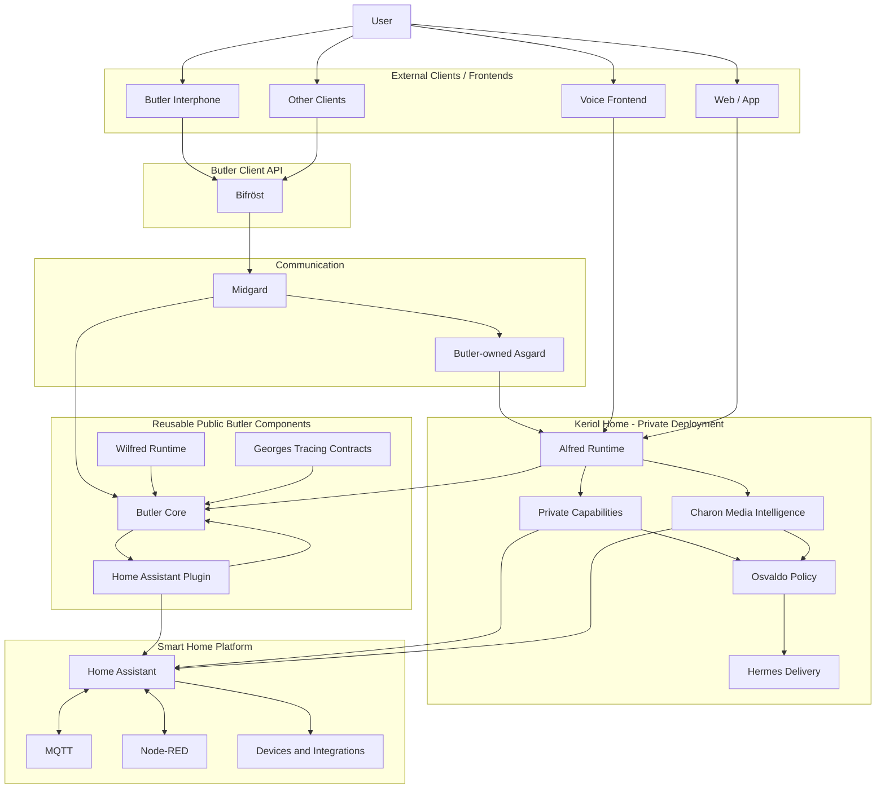

# Architecture


```mermaid
flowchart TD
    User[User]

    subgraph Clients["External Clients / Frontends"]
        Interphone[Butler Interphone]
        Voice[Voice Frontend]
        Web[Web / App]
        Other[Other Clients]
    end

    subgraph ClientAPI["Butler Client API"]
        Bifrost[Bifröst]
    end

    subgraph Comms["Communication"]
        Midgard[Midgard]
        Asgard[Butler-owned Asgard]
    end

    subgraph Public["Reusable Public Butler Components"]
        Core[Butler Core]
        HAP[Home Assistant Plugin]
        Wilfred[Wilfred Runtime]
        Georges[Georges Tracing Contracts]
    end

    subgraph Private["Keriol Home - Private Deployment"]
        Alfred[Alfred Runtime]
        Osvaldo[Osvaldo Policy]
        Charon[Charon Media Intelligence]
        Hermes[Hermes Delivery]
        PrivateCaps[Private Capabilities]
    end

    subgraph Home["Smart Home Platform"]
        HA[Home Assistant]
        MQTT[MQTT]
        NodeRED[Node-RED]
        Devices[Devices and Integrations]
    end

    User --> Interphone
    User --> Voice
    User --> Web
    User --> Other

    Interphone --> Bifrost
    Other --> Bifrost
    Bifrost --> Midgard

    Midgard --> Core
    Midgard --> Asgard
    Asgard --> Alfred

    Wilfred --> Core
    Alfred --> Core
    HAP --> Core
    Georges --> Core

    Core --> HAP
    HAP --> HA

    Voice --> Alfred
    Web --> Alfred

    Alfred --> PrivateCaps
    Alfred --> Charon
    PrivateCaps --> Osvaldo
    Charon --> Osvaldo
    Osvaldo --> Hermes

    PrivateCaps --> HA
    Charon --> HA

    HA --> Devices
    HA <--> MQTT
    HA <--> NodeRED
```

## Reading the diagram

The diagram shows two complementary Butler paths.

### Core-facing client path

```text
Interphone -> Bifröst -> Midgard -> Butler Core -> HAP -> Home Assistant
```

Bifröst owns the external/client API boundary. Midgard owns provider-neutral
communication and cross-Butler routing. Core owns provider-neutral contracts and
execution foundations.

### Concrete-Butler path

```text
Interphone -> Bifröst -> Midgard -> Butler-owned Asgard -> Alfred
```

The concrete Butler owns its identity and behavior. Asgard projects that
Butler-owned identity and provides the governed Butler ingress/egress boundary.

### Runtime relationship

Wilfred and Alfred are sibling Butler runtimes. Neither runtime is built on the
other.

### Home Assistant

Home Assistant remains the physical orchestration owner. HAP is the reusable
integration boundary between Butler runtimes/Core-facing execution and Home
Assistant.

### Observability

Midgard emits routing observability through Butler Core's Georges tracing
contracts. A concrete runtime such as Alfred may provide the sink/persistence,
but the tracing contract remains Core-owned.

See:

- [Bifröst API](../api/bifrost.md)
- [Midgard](../architecture/midgard.md)
- [Asgard](../architecture/asgard.md)
- [Communication Model](../architecture/communication-model.md)
- [IGNITION-001](../milestones/ignition-001.md)
