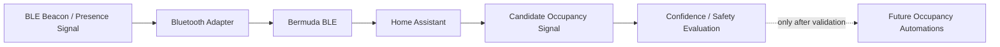

# Presence Flow Diagram

## Status

**Designed to enable.** This is an experimental/candidate flow, not an authoritative occupancy pipeline.

The current private presence work is intentionally conservative: BLE inputs are useful for evaluation, but they are not trusted as a sole source for critical home/away automation.

## Design Boundary

- No room-by-room tracking is required by the target design.
- Experimental BLE trackers must not be treated as authoritative person state.
- Empty-home decisions require stable evidence and a documented safety interval.
- Critical automations remain disabled until the presence signal is sufficiently reliable.
