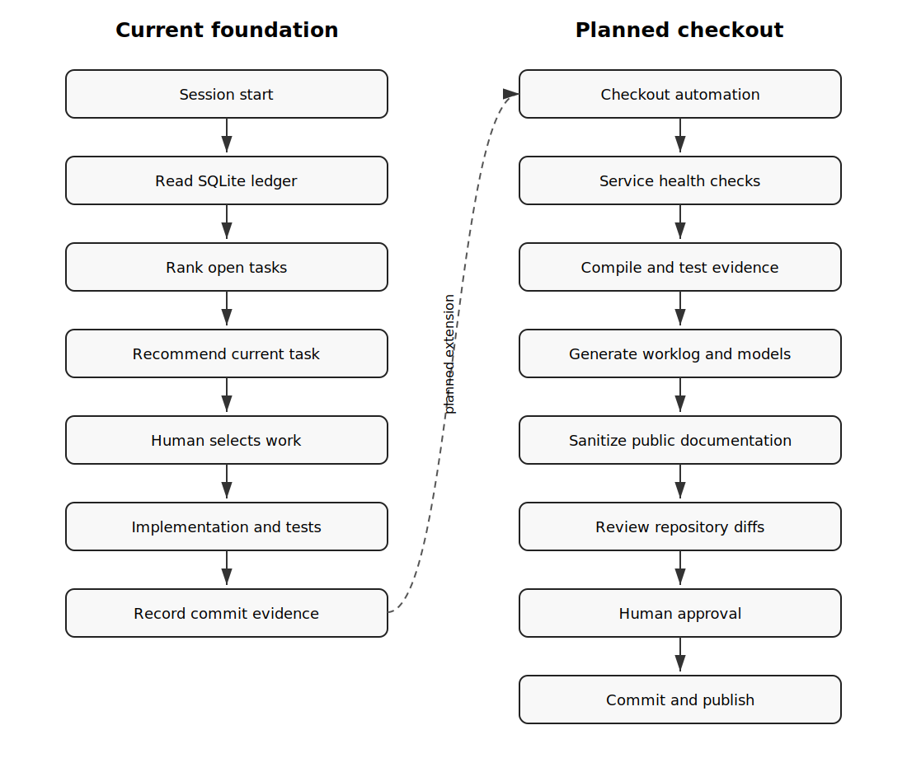

# Umberto Checkout Flow

## Text Fallback

    Session start
      -> read SQLite ledger
      -> rank open tasks
      -> recommend current task
      -> human selects work
      -> implementation and tests
      -> record commit evidence

    Planned checkout:
      -> service health checks
      -> compile and test evidence
      -> worklog and model generation
      -> public sanitization
      -> repository diff review
      -> human approval
      -> commit and reviewed publication

## Responsibility Boundary

- Umberto reads planning state and prepares checkout evidence.
- Alfred and domain services implement runtime capabilities.
- Git preserves tracked implementation and documentation history.
- The human operator approves commit, merge and push operations.
