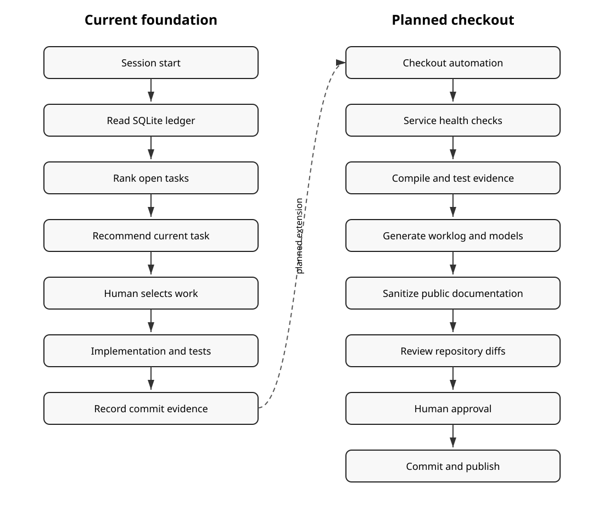

# Historical Umberto Checkout Flow

## Status

**Superseded historical diagram.**

This flow records the former Umberto-based development process. It is preserved as workflow history, not as current development guidance.

Current development governance is defined by [ADR-011 - GitHub as Development Source of Truth](../adr/ADR-011-github-development-source-of-truth.md).

## Historical Text Fallback

    Session start
      -> read SQLite ledger
      -> rank open tasks
      -> recommend current task
      -> human selects work
      -> implementation and tests
      -> record commit evidence

    Planned checkout:
      -> service health checks
      -> compile and test evidence
      -> worklog and model generation
      -> public sanitization
      -> repository diff review
      -> human approval
      -> commit and reviewed publication

## Current Interpretation

The useful principles survive even though the ledger does not:

- planning state needs an explicit authority;
- implementation evidence belongs in Git;
- runtime evidence belongs in live systems;
- public sanitization must be deliberate;
- human approval remains part of sensitive publication and release decisions.

Today GitHub Issues, Git, release evidence and live-system verification own those responsibilities.
