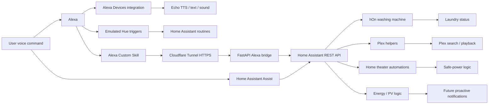

# Voice Flow

```mermaid
flowchart LR
    User[User voice command]

    User --> Alexa[Alexa]
    User --> Assist[Home Assistant Assist]

    Alexa --> AlexaDevices[Alexa Devices integration]
    Alexa --> EmulatedHue[Emulated Hue triggers]
    Alexa --> CustomSkill[Alexa Custom Skill]

    AlexaDevices --> TTS[Echo TTS / text / sound]
    EmulatedHue --> HARoutines[Home Assistant routines]

    CustomSkill --> CF[Cloudflare Tunnel HTTPS]
    CF --> FastAPI[FastAPI Alexa bridge]
    FastAPI --> HA[Home Assistant REST API]

    Assist --> HA

    HA --> Laundry[hOn washing machine]
    HA --> Plex[Plex helpers]
    HA --> Theater[Home theater automations]
    HA --> Energy[Energy / PV logic]

    Laundry --> LaundryStatus[Laundry status]
    Plex --> PlexPlayback[Plex search / playback]
    Theater --> SafePower[Safe-power logic]
    Energy --> Notifications[Future proactive notifications]
```
