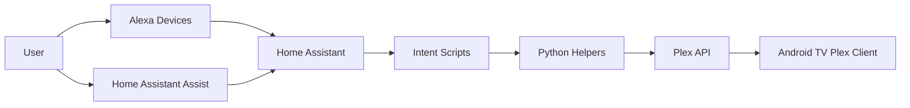

# Voice Flow Diagram

```mermaid
flowchart LR

    User[User]
    Alexa[Alexa Devices]
    Assist[Home Assistant Assist]
    HA[Home Assistant]
    Intent[Intent Scripts]
    Python[Python Helpers]
    Plex[Plex API]
    TV[Android TV Plex Client]

    User --> Alexa
    User --> Assist
    Alexa --> HA
    Assist --> HA
    HA --> Intent
    Intent --> Python
    Python --> Plex
    Plex --> TV
```
