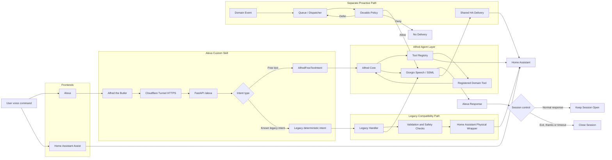

# Voice Flow

## Interactive Voice Flow

Alexa is a frontend. Free-text requests are forwarded to Alfred Core, which selects a registered tool through the Tool Registry.

Known legacy intents remain available for compatibility and deterministic physical-control workflows.

Giorgio renders the spoken response for both Alfred and supported legacy handlers.

## Proactive Voice Flow

Unsolicited domain events do not use the interactive request path.

They pass through the queue or dispatcher and Osvaldo, which may allow, defer or deny delivery before Giorgio renders the message.

## Rules

- `AlfredFreeTextIntent` forwards the free-text query to Alfred Core.
- Known requests use deterministic routing before AI fallback.
- Home Assistant owns physical device wrappers.
- Physical command dispatch is not considered success.
- Device state must be verified whenever supported.
- Interactive responses do not require Osvaldo approval.
- Proactive notifications must pass through Osvaldo.
- Normal responses keep the Alexa session open.
- Exit, thanks and timeout close the session.
