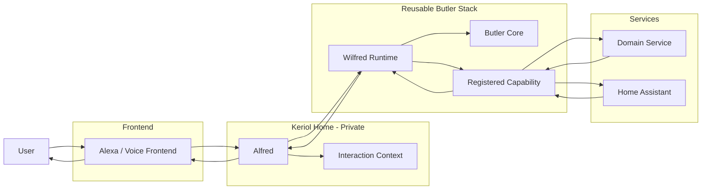

# Voice Interaction Flow

## Purpose

This diagram describes the current architectural responsibilities of the Keriol Home voice path without exposing private implementation.

```mermaid
flowchart LR
    User[User]

    subgraph Frontend
        Alexa[Alexa / Voice Frontend]
    end

    subgraph Private["Keriol Home - Private"]
        Alfred[Alfred]
        Context[Interaction Context]
    end

    subgraph Public["Reusable Butler Stack"]
        Wilfred[Wilfred Runtime]
        Core[Butler Core]
        Capability[Registered Capability]
    end

    subgraph Services
        Service[Domain Service]
        HA[Home Assistant]
    end

    User --> Alexa
    Alexa --> Alfred

    Alfred --> Context
    Alfred --> Wilfred

    Wilfred --> Core
    Wilfred --> Capability

    Capability --> Service
    Capability --> HA

    Service --> Capability
    HA --> Capability

    Capability --> Wilfred
    Wilfred --> Alfred
    Alfred --> Alexa
    Alexa --> User
```

## Responsibilities

### Voice frontend

The active voice frontend captures the request and renders the response.

Speech and SSML rendering remain frontend-specific concerns.

The frontend does not own smart-home orchestration.

### Alfred

Alfred owns the private Keriol interaction context.

It performs deterministic routing where possible and may use AI fallback when appropriate.

Alfred does not become the owner of physical devices.

### Wilfred

Wilfred provides the reusable runtime for registered capabilities, execution, confirmation boundaries and workflows.

### Butler Core

Butler Core provides the provider-neutral contracts and execution foundations underneath Wilfred.

### Domain capability

A registered capability talks to the service that owns the requested domain.

When Home Assistant is involved, Home Assistant remains the owner of physical orchestration and device wrappers.

## Physical actions

Where observable state matters, the expected model is:

    READ -> ACTION -> READ -> VERIFY

Successful command dispatch is not treated as proof of physical success.

## Legacy voice paths

Some older Keriol voice paths predate the current Butler layering and may remain temporarily during convergence.

They are implementation history rather than the reusable architectural boundary.

## Public boundary

This document intentionally describes responsibilities and flow rather than publishing the readable Alfred implementation.
